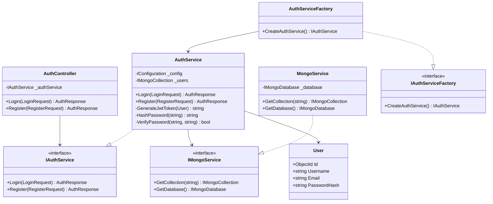

```mermaid

classDiagram
    
    %% Handles HTTP requests for auth endpoints
    class AuthController {
        -IAuthService _authService
        +Login(LoginRequest) AuthResponse
        +Register(RegisterRequest) AuthResponse
    }

    %% Contract for authentication operations
    class IAuthService {
        <<interface>>
        +Login(LoginRequest) AuthResponse
        +Register(RegisterRequest) AuthResponse
    }
    
    %% Implements authentication logic
    class AuthService {
        -IConfiguration _config
        -IMongoCollection<User> _users
        +Login(LoginRequest) AuthResponse
        +Register(RegisterRequest) AuthResponse
        -GenerateJwtToken(User) string
        -HashPassword(string) string
        -VerifyPassword(string, string) bool
    }
    
    %% Contract for MongoDB operations
    class IMongoService {
        <<interface>>
        +GetCollection<T>(string) IMongoCollection<T>
        +GetDatabase() IMongoDatabase
    }
    
    %% Handles MongoDB connections
    class MongoService {
        -IMongoDatabase _database
        +GetCollection<T>(string) IMongoCollection<T>
        +GetDatabase() IMongoDatabase
    }
    
    %% Data model for user
    class User {
        +ObjectId Id
        +string Username
        +string Email
        +string PasswordHash
    }
    
    %% Factory pattern contract
    %% Factory-mönstret används när vi vill dölja komplexiteten i valet av vilken 
    %% klass som ska instansieras baserat på indata.
    class IAuthServiceFactory {
        <<interface>>
        +CreateAuthService() IAuthService
    }
    
    %% Creates AuthService instances
    class AuthServiceFactory {
        +CreateAuthService() IAuthService
    }

    AuthController --> IAuthService
    AuthService ..|> IAuthService
    AuthService --> IMongoService
    MongoService ..|> IMongoService
    AuthServiceFactory ..|> IAuthServiceFactory
    AuthServiceFactory --> AuthService
    AuthService --> User
```