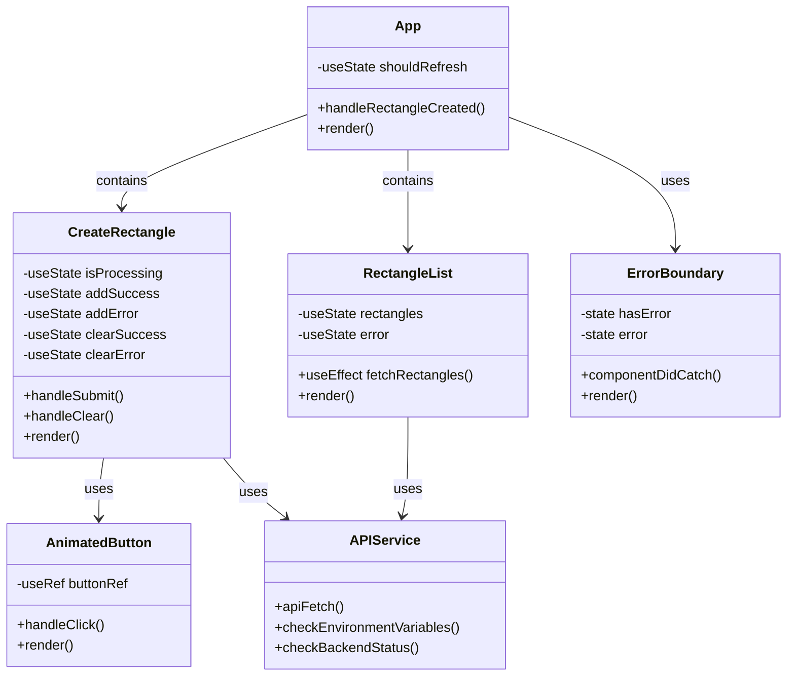


## Innehåll

**[01. Övergripande](01.%20Övergripande.md)**

**[02. Frontend](02.%20Frontend.md)** - Aktuell sida

**[03. Backend](03.%20Backend.md)**

**[04. Backend Tester](04.%20Backend%20Tester.md)**

**[05. Infrastruktur](05.%20Infrastruktur.md)**

---

# 02. Frontend

## Översikt

Frontend-applikationen är byggd i React.js och använder vanilla CSS för styling. Vite används som byggverktyg för snabb utveckling och optimerad produktion. Applikationen tillämpar en komponentbaserad arkitektur med fokus på återanvändbarhet, prestanda och användarvänlighet.

## Teknisk Stack

- React.js - Ramverk för att bygga komponentbaserade UI.
- Vite - Byggverktyg som ersätter Webpack och ger snabbare utvecklingsloop.
- Yarn - Pakethanterare.
- CSS Modules - Modulär och skalbar styling.
- Fetch API - För kommunikation med backend.

## Kodstruktur och förklaring

### Huvudkomponenter

**App: App.jsx**
Rotkomponent som hanterar applikationens övergripande struktur.

- Funktionalitet:
  - Global state-hantering för rektangeluppdateringar
  - Felhantering via ErrorBoundary
  - Koordinering mellan skapande och visning av rektanglar
- Nyckelkomponenter:
  - CreateRectangle
  - RectangleList
  - ErrorBoundary

**API-hantering: api.js**
Centraliserad API-kommunikation med robust felhantering.

- Funktioner:
  - Miljövariabelvalidering
  - Backend-statuskontroll
  - Standardiserad felhantering
- Säkerhetsfunktioner:
  - API-nyckelautentisering
  - CORS-hantering
  - Felrapportering

### Komponenter
**CreateRectangle**
Hanterar skapande av nya rektanglar.

- Funktionalitet:
  - Formulärhantering
  - Positionsberäkning för nya rektanglar
  - Statushantering (laddning, success, error)
- Egenskaper:
  - Asynkron API-kommunikation
  - Återkoppling till användaren
  - Förhindrar dubbla inskickningar

**RectangleList**
Visar och organiserar rektanglar.

- Funktionalitet:
  - Dynamisk datahämtning
  - Automatisk uppdatering
  - Kolumnbaserad layout
- Egenskaper:
  - Sortering av rektanglar
  - Responsiv design
  - Felhantering vid datahämtning

**AnimatedButton**
Återanvändbar knappkomponent med animationer.

- Funktionalitet:
  - Klickanimationer
  - Tillståndshantering
  - Återanvändbar design
- Egenskaper:
  - Anpassningsbar styling
  - Händelsehantering
  - Tillgänglighetsanpassad

### CSS-arkitektur

Huvudfilen för styling är `main.css` som använder separata filer för variabler och effekter, som importeras (effects.css, variables.css).

- CSS-moduler används för att isolera styling och undvika globala konflikter.
- Flexbox och grid används för layout och responsivitet.
- Animeringar och övergångar används för att förbättra användarupplevelsen.
- Variabler används för att hantera färger, typografi och layout.
- Responsiv design implementeras med media queries och flexbox.
- Tillgänglighetsanpassningar inkluderar kontrast, fokusindikatorer och skärmläsarkompatibilitet.

### Felhantering

**ErrorBoundry**

Frontend använder en ErrorBoundary för att fånga fel i komponenter och visa en användarvänlig felmeddelande.

- Funktionalitet:
  - Fångar React-komponentfel.
  - Visar användarvänliga felmeddelanden.
  - Förhindrar applikationskrascher.

### Styling

**Styling**
- `main.css` är huvudfile för styling och använder separata filer för variabler och effekter, som importeras.