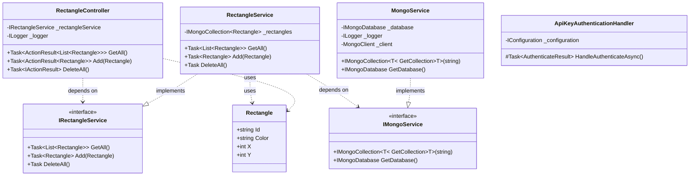


## Innehåll

**[01. Övergripande](01.%20Övergripande.md)**

**[02. Frontend](02.%20Frontend.md)**

**[03. Backend](03.%20Bäckend.md)** - Aktuell sida

**[04. Backend Tester](04.%20Backend%20Tester.md)**

**[05. Infrastruktur](05.%20Infrastruktur.md)**

---

# 03. Backend

## Översikt
Backend är byggt i ASP.NET Core och använder MongoDB som databas. Systemet är designat med fokus på skalbarhet, säkerhet och tillförlitlighet. All backend-kod körs i en Docker-container och MongoDB-data persisteras i en Docker volume. Systemet använder API-nyckelautentisering för säkerhet och Swagger för API-dokumentation i utvecklingsmiljön.

## UML

## Teknisk Stack
- ASP.NET Core - Modernt, högpresterande backend-ramverk
- MongoDB - Dokumentbaserad NoSQL-databas
- Docker - Containerisering och orchestrering
- Swagger/OpenAPI - API-dokumentation och testning
- xUnit & Moq - Testramverk för enhetstester
- DotNetEnv - Hantering av miljövariabler

## Kodstruktur och förklaring

### Huvudkomponenter

**Startfil: Program.cs**
- Konfigurerar tjänster och middleware.
- Laddar miljövariabler från .env.
- Implementerar:
  - CORS-policy med miljöspecifika origins.
  - API-nyckelautentisering.
  - Swagger/OpenAPI integration.
  - Dependency Injection för tjänster.
  - Loggning och felhantering.

**API-kontroller: RectangleController.cs**
- RESTful endpoints för rektangelhantering:
  - GET /api/rectangle - Hämtar alla rektanglar.
  - POST /api/rectangle - Skapar ny rektangel.
  - DELETE /api/rectangle - Raderar alla rektanglar.
- Implementerar:
  - API-nyckelautentisering.
  - CORS-policy.
  - Omfattande felhantering och loggning.
  - Asynkron operationshantering.

**Databashantering: MongoService.cs**
- Hanterar databasanslutning och operationer
- Funktionalitet:
  - Automatisk återanslutning vid fel.
  - Konfigurationsvalidering.
  - Miljövarabelhantering för anslutningsdetaljer.
  - Samlingshantering för olika datatyper.

**Tjänstelager: RectangleService.cs**
- Hanterar logik för att hämta, lägga till och radera rektanglar i databasen.
- Använder MongoService för att ansluta till databasen och utföra operationer.

**Datamodell: Rectangle.cs**
- Representerar en rektangel i databasen.
- Innehåller egenskaper:
  - Id (MongoDB ObjectId)
  - Color (string)
  - X (int)
  - Y (int)
- MongoDB-specifika attribut för serialisering.

### Säkerhet

**Säkerhet: ApiKeyAuthenticationHandler.cs**
- JWT används för autentisering.
- Verifierar API-nycklar från förfrågningar.
- Laddar giltiga API-nycklar från miljövariabler.

### Felhantering och Loggning
- Strukturerad felhantering på flera nivåer:
  - Globalt middleware för oväntade fel
  - Kontroller-specifik felhantering
  - Tjänstenivå felhantering
- Omfattande loggning av:
  - API-anrop och svar
  - Databasoperationer
  - Autentiseringsförsök
  - Systemhändelser

### Konfiguration och Miljöer
- Utvecklingsmiljö
  - Laddar konfiguration från .env-fil
  - Aktiverar Swagger UI
  - Tillåter lokala CORS-origins
  - Detaljerad loggning

- Produktionsmiljö
  - Använder miljövariabler för konfiguration
  - Striktare CORS-policy
  - Optimerad för prestanda
  - Begränsad loggning

### CI/CD
- Byggs och testas i CI/CD-pipelinen.
- Flera steg för att bygga, testa och distribuera. Se [CI/CD](01.%20Övergripande.md#CI/CD) för mer information.

### API-dokumentation
- Swagger/OpenAPI integration tillgänglig i utvecklingsmiljö
- Åtkomst: http://localhost:5129/swagger/index.html
- Funktioner:
  - Interaktiv API-testning
  - Automatgenererad dokumentation
  - Autentiseringsstöd
  - Schemabeskrivningar